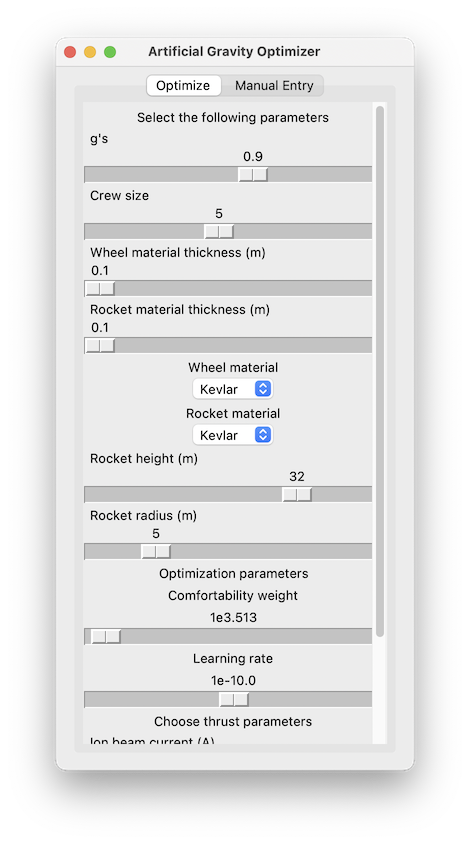
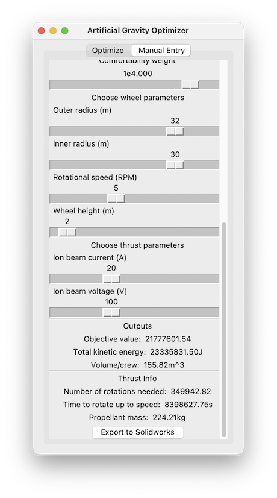

# Artificial Gravity Optimizer
## Downloading the program
Extract the zip provided or run `git clone git@github.com:jkapilian/gravity-optimizer.git` in the direetory you would like to run it in.

## Running the program
To run the optimizer, you must have Python installed on the machine you are running it. NOTE: Run `pip install tkinter` and `pip install numpy` if these dependencies are not already installed. Open up the terminal in the directory the files are cloned in and run
```python main.py```

## Using the optimizer
### Optimization Mode
1. Select ‘Optimize’ from top tab bar (should be selected by default).
2. Change parameters as needed by modifying the corresponding sliders.

3. Click 'Optimize' at the bottom of the window to begin running the optimizer. The optimized parameters will be displayed after the optimization completes.


  a. NOTE: If the program hangs due to parameters that will not converge, press `CTRL+C` in your terminal window.
4. To view optimized design as model, select 'Export to Solidworks' and navigate to the directory of your Solidworks model to save the dimension files for the rocket and wheel. Open the 3D model in Solidworks to view with these dimensions.

### Manual Mode
1. Select 'Manual Entry' from top tab bar.
2. Change any of the parameters by moving the corresponding sliders.

3. Observe as the output parameters change as the inputs are modified.

4. To save a given configuration as an importable dimension file for SolidWorks, click on ‘Export to Solidworks’. Navigate to the directory of your Solidworks model to save the dimension files for the rocket and wheel. Open the 3D model in Solidworks to view with these dimensions.

## Notes on Optimization Parameters
* As the magnitude of the kinetic energy term is much larger than that of volume per crew member, moving the beta hyperparameter between 10^3.5 and 10^4.1 with a learning rate between 10^-11 and 10^-9 best characterize the tradeoff between crew comfortability and energy usage.
* Alpha is always set to 1 as any other changes could simply be represented as a scalar multiple of the objective with Alpha=1 with a larger objective value while still converging to the same paramter values
* As expected, for lower Beta values (i.e. favoring energy reduction), the program converges to the minimial constraint values.